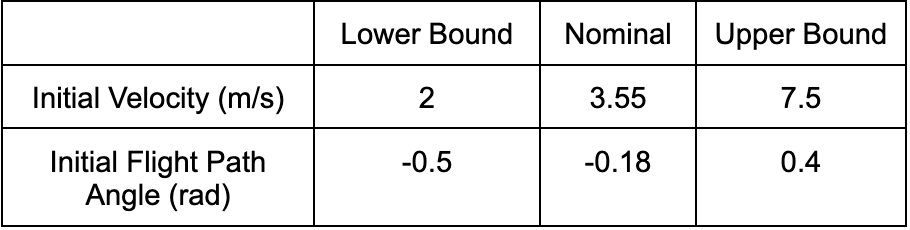
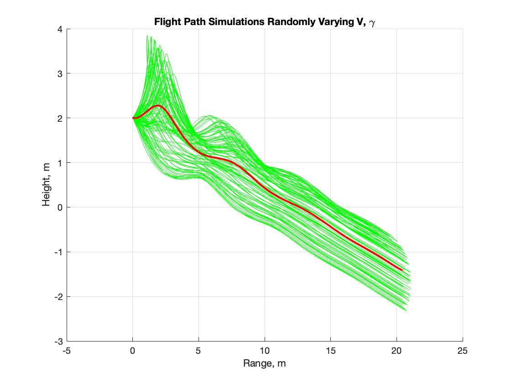
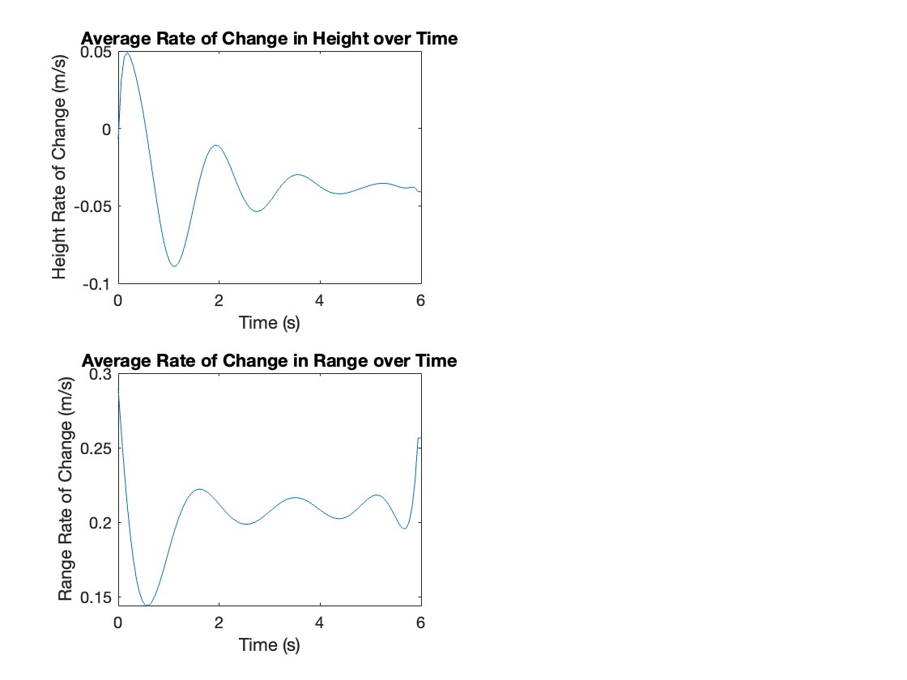

  # Paper Airplane Numerical Study
  Final Project: AEM 3103 Spring 2024

  - By: Dawson Schaefer

  ## Summary of Findings
  

  This study simulates the effects of varying the initial velocity and flight path angle of a paper airplane on its
  flight path. The flight path at the bounds of the velocity and angle as well as the nominal velocity and angle were
  tested individually and then values between the bounds were randomized and the flight path was simulated 100 times in
  the Monte Carlo simulation. An initial velocity above nominal caused the plane quickly increase in height before 
  quickly decreasing in height, whereas an initial velocity below nominal caused the plane to slowly decrease in height.
  Varying the initial flight path angle had a similar but lesser effect. The above nominal flight path angle caused an
  increase in height before quickly dampening out and the below nomina flight path angle caused a decrease in height
  before returning to nominal (Fig.1). The average flight path in the Monte Carlo simulation increased in height before decreasing
  and returning to a fairly nominal flight path as seen in Fig.2. The rate of change in height and range of the average flight
  path were calculated and plotted in Fig.3.
 
  # Code Listing
  [EqMotion.m](EqMotion.m) : Outputs the fourth-order equations of aircraft motion  
  [PaperPlane.m](PaperPlane.m) : Graphs paper plane flight paths and the average rate of change in height and range over time
  
  # Figures

  ## Fig. 1: Single Parameter Variation
  

  Flight path with variation in initial velocity and flight path angle

  ## Fig. 2: Monte Carlo Simulation
  

  100 flight paths with random variations in initial velocity and flight path angle shown in green.
  Average of the random flight paths is shown in red.

  ## Fig. 3: Time Derivatives
  

  Changes in height and range with respect to time

